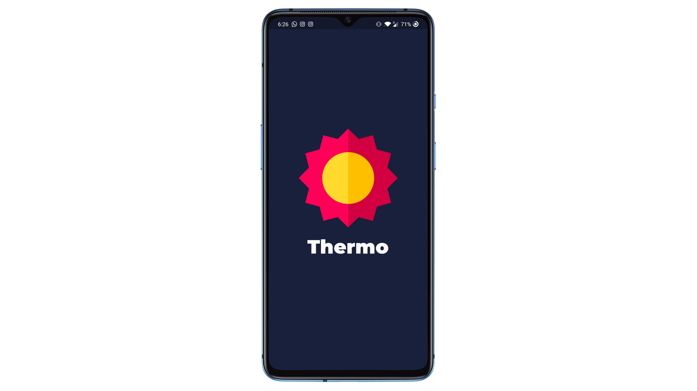

# Thermo

A weather app made using Flutter and the OpenWeatherMap API. The application follows minimal design principles and displays accurate weather information to the user in a neat and clean way.

## Contents

- [Technologies Used](#technologies-used)
- [Introduction](#introduction)
- [Permission Screen](#permission-screen)
- [Home Screen](#home-screen)

## Technologies Used

| Name               | Description                                                                                                                                                                                                              |
| ------------------ | ------------------------------------------------------------------------------------------------------------------------------------------------------------------------------------------------------------------------ |
| Flutter            | Flutter is an open-source UI software development kit created by Google. It is used to develop cross platform applications for Android, iOS, Linux, Mac, Windows, Google Fuchsia, and the web from a single codebase.    |
| OpenWeatherMap API | OpenWeatherMap is an online service, owned by OpenWeather Ltd, that provides global weather data via API, including current weather data, forecasts, nowcasts and historical weather data for any geographical location. |

## Introduction

This application has been designed using the Flutter framework which is a cross-platform application development framework. Thermo has a minimal design and displays all the necessary information without making the app look cluttered and messy.

## Permission Screen

When a user launches the app for the first time, they are prompted with a request to allow granting location access. The app requires location permission so that we can get accurate data for the user's location.

## Home Screen

The Home screen fetches the weather information for the user's current location. The Home page displays the user's current location at the top along with the date. This is followed by the current weather forecast along with the current temperature. Other details such as the sunrise and sunset times, humidity and visibility are displayed under the temperature in a neat tabular format.

Below the current weather, the weather forecast for the next 5 days is displayed in a carousel of cards. These cards show the average temperature, date, weather forecast and the minimum and maximum temperatures for that particular date.

